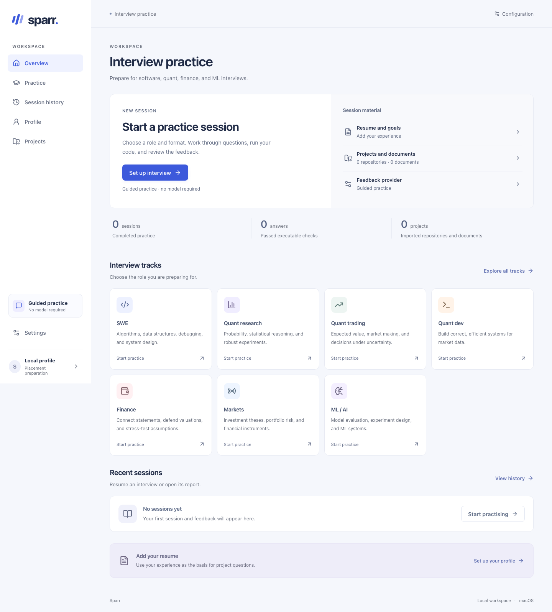
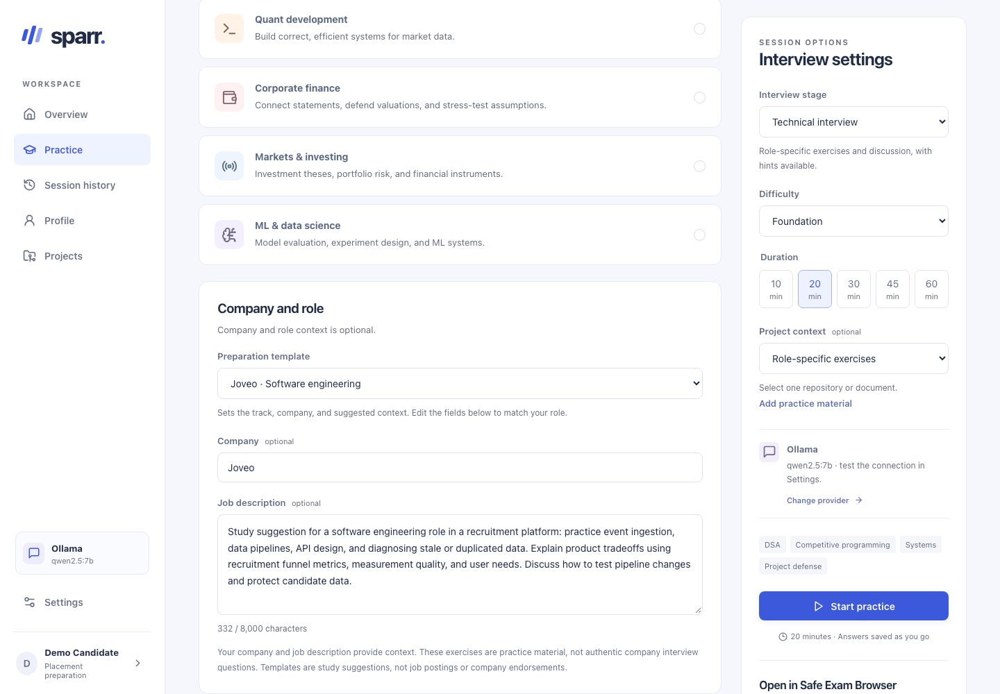
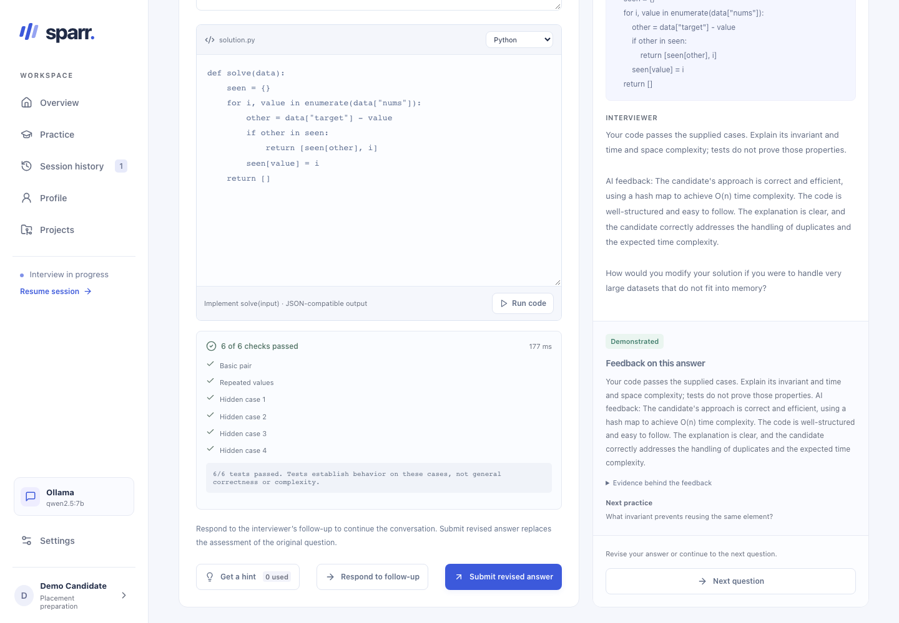
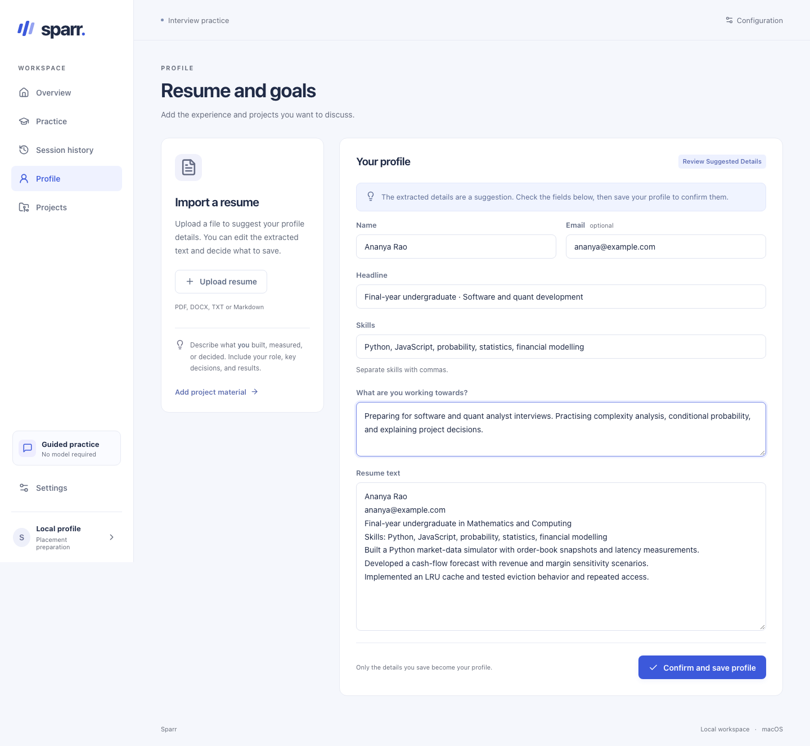
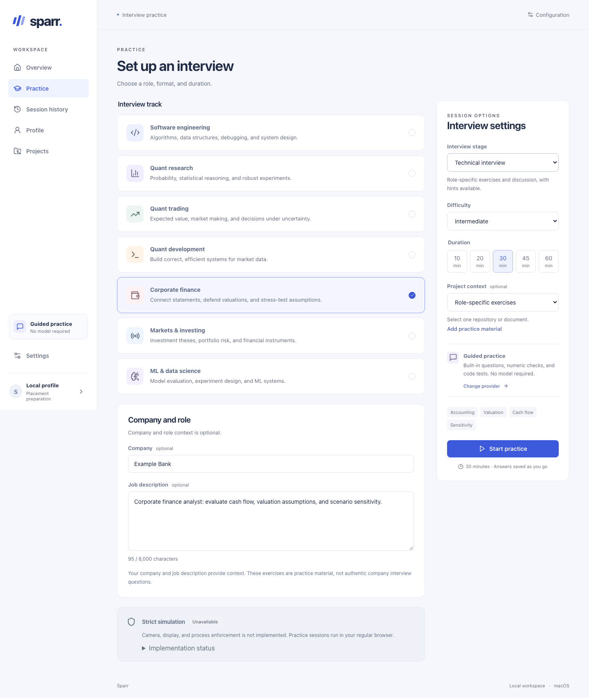
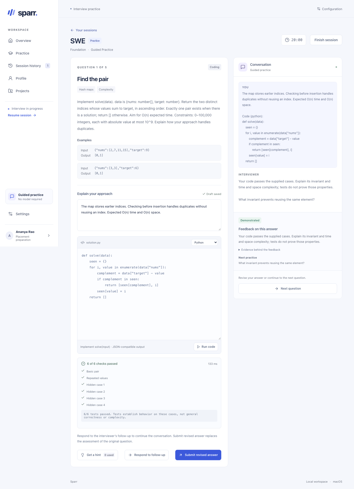
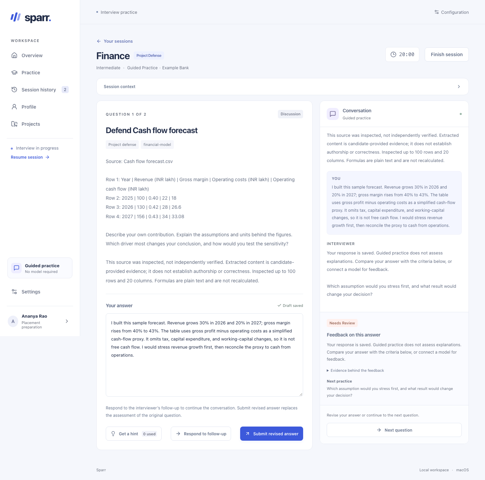
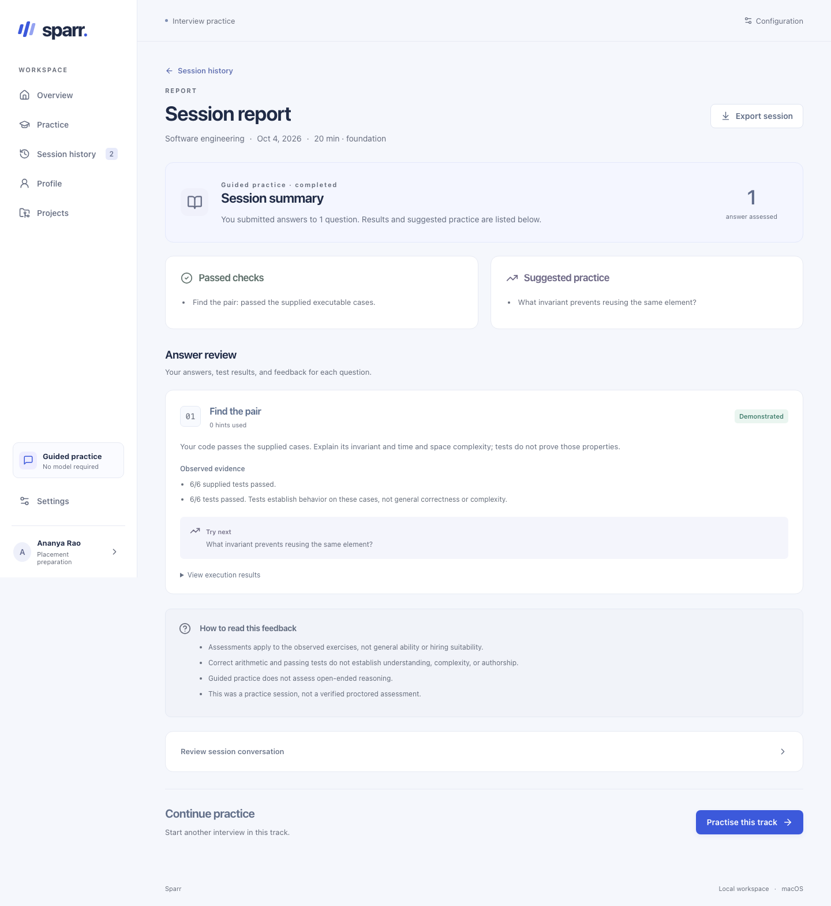
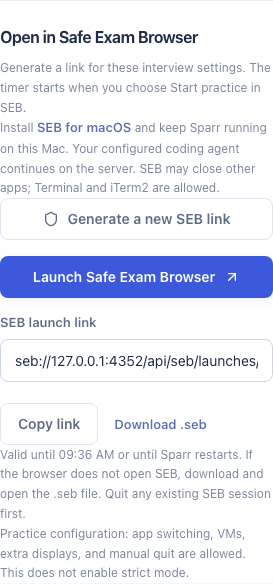
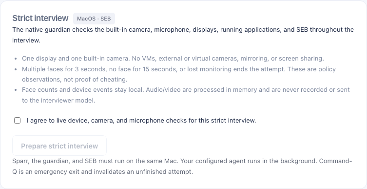

# Sparr

[](https://github.com/Hasan72341/sparr/actions/workflows/verify.yml)

**Interview practice around your resume, projects, and the role you want.**

Sparr is for a friend preparing for campus placements at Trilogy, Assurant, and Joveo: solving a coding problem is one part of the interview; explaining a project, defending an assumption, or working through a finance case needs practice too. It brings those sessions into one local workspace, with executable checks, optional AI feedback, and a history to revisit.

**macOS first. Windows support will be added later. Linux is not planned.** This release runs from source under the [MIT license](LICENSE); no Sparr account is required.

[Start here](#get-started) · [Demo](docs/demo/README.md) · [Screenshots](#see-it-in-use) · [Local AI](#use-a-local-model) · [SEB](#practice-in-safe-exam-browser) · [Contributing](CONTRIBUTING.md)



## Get started

Install **Node.js 24+**, **Python 3**, and **Git** on your Mac. Clone the repository, then build and start it:

```sh
git clone https://github.com/Hasan72341/sparr.git
cd sparr
npm ci
npm run build
npm start
```

Open **http://127.0.0.1:4318**. Keep the terminal open; Control-C stops the server. Alternatively, double-click **Sparr.command** to install missing npm dependencies, build, and open the app.

The default **Guided practice** needs no model or API key. It runs code, checks numeric answers, and provides discussion rubrics. Add a model for feedback on your reasoning and a tailored follow-up. Ordinary practice needs neither SEB nor camera/microphone access.

### Your first session

1. In **Profile**, import a PDF, DOCX, TXT, or Markdown resume. Review and edit the extracted fields before saving.
2. In **Projects**, optionally add a public GitHub repository, research document, notebook, or financial model.
3. In **Practice**, choose a track, format, difficulty, and duration. Add company or job-description context if useful.
4. Answer, test your code, and work through the follow-up. **Finish session** opens the report; **Session history** keeps your work for the next attempt.

## What you can practise

| Track | Examples |
| --- | --- |
| Software engineering | DSA, competitive programming, debugging, system design |
| Quant research | Probability, statistics, experiments, backtesting |
| Quant trading | Expected value, mental math, market making, risk |
| Quant development | Order books, algorithms, concurrency, performance |
| Corporate finance | Accounting, valuation, cash flow, sensitivity |
| Markets and investing | Bonds, portfolio risk, investment theses |
| ML and data science | Evaluation, leakage, experiment design, ML systems |

Choose technical interviews, timed assessments without hints, project defense, or behavioral practice. Questions adapt using previous attempts, results, and hint use. The bank is finite; company context does not supply a company's actual interview questions.

Python and JavaScript answers run against test cases in a macOS sandbox. Numeric answers use reference values and tolerances. Discussion answers have review criteria; Guided practice does not grade their reasoning.

Public GitHub imports retain selected source at a recorded commit. Supported project tests use dependency-free Python `unittest` or Node `node:test`; arbitrary dependency installation and application startup are not supported. Document imports accept PDF, DOCX, TXT, Markdown, IPYNB, XLSX, and CSV up to 5 MB. Notebook cells are not executed, spreadsheet formulas are not recalculated, and scanned PDFs need OCR elsewhere.

### Company preparation

Editable templates cover **Trilogy, Assurant, Joveo, JPMorganChase, and Goldman Sachs**. Choose one under **Company and role**, then tailor the context to your actual job description. The [preparation guide](docs/preparation.md) explains the suggested focus and links to official career pages. These are practice templates, not company question banks.

Early feedback from the friend has been positive. The focus is on useful practice and clearer explanations; no placement outcome has been measured.

## See it in use

[Watch in the browser](https://hasan72341.github.io/sparr/demo/) · [Demo transcript](docs/demo/README.md)

<details>
<summary><strong>Company preparation and local AI</strong></summary>

Choose editable Joveo context, run a Python solution, and receive feedback from a local open model.




</details>

All captures use sample data. The company/local-AI images and recorded demo use Ollama. The older interview examples below use Guided practice, and the SEB launch screen uses Claude Code. Coding results come from execution.

<details>
<summary><strong>Resume review and interview setup</strong></summary>

Confirm the imported profile, then choose the role, format, and context for a session.




</details>

<details open>
<summary><strong>Coding: run a solution and explain it</strong></summary>

This Python submission passes all six cases. The follow-up asks about the implementation's invariant.



</details>

<details>
<summary><strong>Finance: defend assumptions in your own model</strong></summary>

An imported cash-flow forecast supplies the figures for a project discussion. The response is saved alongside review criteria.



</details>

<details>
<summary><strong>Report: revisit the evidence from a session</strong></summary>



</details>

<details>
<summary><strong>SEB: launch controls and strict-mode consent</strong></summary>

The strict setup screen shows the disclosure before capture starts.




</details>

## How AI fits

The interview controller owns question selection, timing, difficulty, test execution, and saved state. It sends the candidate's answer, relevant resume/project context, and observed results to a provider. The provider returns feedback and one follow-up. It cannot change test results or execute project code. See the [architecture](docs/architecture.md) for the complete flow.

This separation lets you change the feedback model without moving your interview history or rebuilding the runner. Claude Code is supported as a restricted background process; its tools, hooks, skills, and MCP servers are disabled. Codex remains disabled until its isolation is verified.

### Use a local model

1. Follow the [Ollama quickstart](https://docs.ollama.com/quickstart), download a local model that fits your Mac's memory and storage, and leave Ollama running. Use local inference to keep interview context on the Mac.
2. In Sparr's **Settings**, select **Ollama**, enter the exact installed model name, and use `http://127.0.0.1:11434` as the base URL.
3. Save, click **Test connection**, then start a new interview. The model must return structured feedback; an error produces labelled guided feedback while preserving your answer.

**Tested model:** `qwen2.5:7b` through Ollama 0.35.1 on an Apple M3 Mac with 24 GB memory. Download it with `ollama pull qwen2.5:7b` (about 4.7 GB). Real coding and probability sessions received model feedback and saved their reports; the code passed 6/6 cases. The smaller 1.5B model returned incorrect coding advice during testing, so it is not the suggested default. Model feedback still needs judgment. See the [local-model guide and evidence](docs/local-model.md).

With Ollama running and the model installed, `npm run verify:local-model` repeats the real-provider check in a disposable workspace. It fails if feedback falls back to Guided practice.

### Other providers

| Provider | Setup |
| --- | --- |
| Guided practice | Default; deterministic checks and built-in follow-ups, without AI. |
| Claude Code | Install and sign in on the Mac running Sparr. The CLI must support `--safe-mode`, `--restricted`, and `--tools`. Model can be blank. A live interview has been verified. |
| OpenAI-compatible API | Enter a model and HTTPS base URL ending in `/v1`; localhost HTTP is also allowed. Set `SPARR_MODEL_API_KEY` in `.env` if required. Adapter tests use simulated responses. |

Save and test a provider in **Settings**. Changes apply to new sessions. Remote providers receive the submitted context, including resume and project excerpts; a local CLI can still call a cloud service.

### Why open models matter here

Resumes and interview answers can be personal. A model running entirely on your Mac lets you practise with that context locally. Once dependencies and model weights are installed, local inference needs no hosted inference account; fetching GitHub projects still needs a connection. You can try another model while keeping the same exercises, execution checks, and saved history. Guided practice also keeps the app usable when no model is available.

Sparr is [MIT-licensed](LICENSE), so its exercises, controller, and provider adapters can be inspected and adapted. Model weights have their own licenses and hardware requirements. This is the practical connection to Hacktoberfest 2026's [“AI belongs to everyone”](https://hacktoberfest.com/) theme: control over the software, model, and interview data.

## Practice in Safe Exam Browser

Install [SEB for macOS](https://safeexambrowser.org/download_en.html#MacOSX), then choose **Practice → Generate SEB link → Launch Safe Exam Browser**. If the browser handoff is blocked, open **Download .seb** instead. The generated `seb://` link carries your setup; the timer starts when you click **Start practice** inside SEB.

Practice links last 30 minutes and expire on server restart or data deletion. Keep Sparr's terminal running and quit an existing SEB session before loading a new configuration. These links refer to the local server. Practice mode permits VMs, extra displays, application switching, and Command-Q.

**Strict interviews** add admission and continuous device checks through a native guardian. They require macOS 14+, SEB 3.7+, one built-in camera, one display without mirroring, a working microphone, and a physical Mac. Build with `npm run native:build` using Xcode Command Line Tools, then follow the [strict setup guide](docs/strict-mode.md#starting-a-strict-interview).

After consent, the guardian checks devices, capture, face count, prohibited applications, and the signed SEB process. A policy violation ends the attempt, retains saved work and the reason, and requests SEB exit. The configured provider continues through the background server. Camera and microphone samples stay in memory on the Mac; they are not recorded or sent to the model.

Strict mode is a local self-practice policy. It does not prove cheating or prevent the machine's owner from modifying the application. The maintainer reports that physical-device validation passed. The helper remains an ad-hoc build; broader device/version coverage and notarized distribution are tracked in the verification record. See [policy and limits](docs/strict-mode.md), [verification](docs/verification.md), and the [existing-VM lab](docs/seb-vm-lab.md).

## Data and configuration

React provides the UI; Express, SQLite, and sandboxed workers run locally. The server binds to `127.0.0.1` and has no multi-user authentication. Use it as a local application.

Copy `.env.example` to `.env` to override defaults:

| Variable | Default | Purpose |
| --- | --- | --- |
| `SPARR_PORT` | `4318` | Local server port |
| `SPARR_DATA_DIR` | `.data` | Database and imported repositories |
| `SPARR_MODEL_API_KEY` | Unset | Credential for a compatible API |

**Settings → Export workspace** produces a JSON export; **Delete all data** clears saved work. For a full backup, stop Sparr and copy the data directory. Raw uploads are discarded after parsing; extracted text remains. Deleting a document does not remove excerpts already cited in saved sessions.

Keys stay on the server and out of exports. `.env` and `.data` are Git-ignored. Read [security and data handling](docs/security.md) before changing the local deployment boundary.

## Development and verification

```sh
npm run dev         # App and API with source reload
npm run check       # TypeScript
npm test            # Unit and integration tests
npm run build       # Production client and typecheck
npx playwright install chromium webkit
npm run test:e2e     # Isolated browser workspaces
```

Latest checks on **5 October 2026**: 102 unit/integration tests, 44 browser tests across Chromium and WebKit, build, typecheck, and the live local-model check passed. The [GitHub macOS run](https://github.com/Hasan72341/sparr/actions/runs/37232628940) also passed, including the native guardian checks. Live Claude Code and real SEB launch/exit flows were also exercised; strict lab admission used synthetic native observations. [Verification](docs/verification.md) records the environments and remaining hardware checks.

Useful contributions include question edge cases, finance/quant explanations, parser fixtures, accessible interaction, and reproducible local-model checks. See [Contributing](CONTRIBUTING.md) for setup, test isolation, and question requirements. Please use synthetic candidate data.

## Further reading

- [Architecture](docs/architecture.md) and [API contract](docs/api-contract.md)
- [Troubleshooting](docs/troubleshooting.md)
- [Roadmap](docs/roadmap.md), including macOS distribution and later Windows support
- [Placement preparation](docs/preparation.md), company templates and suggested practice
