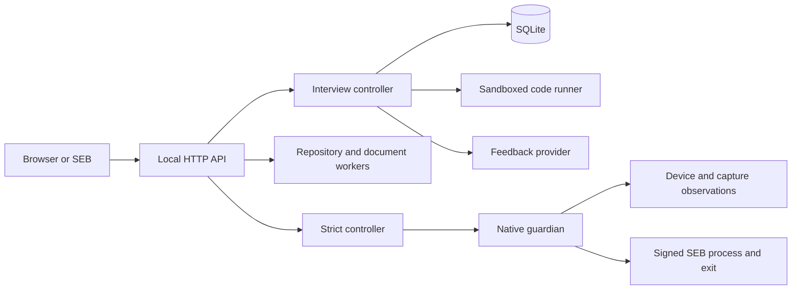

# Architecture

Sparr is a single-user application: one Node process serves the React client and local API, owns a SQLite database, and starts bounded worker processes. A separate model service is optional.

## Session flow

1. `app.ts` validates the requested role, format, difficulty, duration, and attachments.
2. `interviews.ts` selects built-in exercises using past attempts. It adds source-based discussion prompts when a resume, repository, or document is attached.
3. The browser saves drafts by question. Mutations for each session are serialized; request IDs prevent repeated answer submissions from creating duplicate assessments.
4. Numeric answers are compared with a reference value. Coding answers run through `runner.ts`. Discussion answers receive a rubric without a deterministic correctness verdict.
5. If configured, `providers.ts` sends the question, response, recent conversation, and observed assessment evidence to the model. Validated feedback and one follow-up are appended to the session. A failed request falls back to guided feedback.
6. On **Next question**, selection may adjust difficulty using results and hints. On completion or timeout, the controller saves a report. Follow-up responses are stored separately from the original assessment.

The provider does not execute candidate code, set scores, choose arbitrary tools, or manage the session timer. Claude Code runs as a restricted subprocess; Ollama and compatible services receive HTTP requests. Code execution belongs to the controller and its sandboxed runner.

## Imports and execution

Public GitHub imports fetch a bounded snapshot without checkout, hooks, or dependency installation. Questions cite selected files at a recorded commit. Supported project tests run in a disposable workspace with Python's standard-library `unittest` or Node's built-in test runner.

Resume and document parsing use a separate sandboxed process. Only extracted profile text and source excerpts are retained. Notebook code and spreadsheet formulas are read, not evaluated.

The macOS runner denies network access, home-file access, and process creation. Time, output, memory, and workspace checks bound execution. These limits are suitable for local practice; they are not a multi-tenant service boundary. Details are in [security.md](security.md).

## State and deployment

`store.ts` stores JSON records in SQLite with WAL enabled. The data directory also contains imported repositories. Settings are captured when a session starts, so changing a provider does not change an existing session. Exports omit provider credentials.

The server listens on loopback and validates local requests. There is no hosted multi-user mode. The SEB lab uses a reverse SSH tunnel from an existing guest to a separate host-side workspace; it does not expose the app on the LAN.

The original `sparr-inspect` helper reports inventory for Settings without capture. Strict mode uses the separate `Sparr Guardian.app` bundle described below. The implementation targets macOS; Windows support will be added later and Linux is out of scope.

## Strict admission and enforcement

The Node server, Guardian, and SEB run on the same physical Mac. `strict.ts` allows one strict setup or session at a time. Preparing a setup starts the guardian only after disclosure and consent, creates a ten-minute in-memory handoff, and generates both the strict `.seb` settings and their Config Key. The browser must use a dedicated strict launch route; direct session creation with `mode: strict` is rejected.

`Guardian.swift` requests camera/microphone access and emits one-second observations over stdout. Node validates that private protocol rather than accepting hardware evidence from HTTP clients. Guardian captures only from the built-in camera, counts faces using Vision, and checks live audio samples without analyzing speech. It also observes displays, discovered cameras, VM signals, prohibited bundle IDs, and the signed foreground SEB process. Frames and audio never leave guardian memory.

At admission, the controller compares SEB's page-bound configuration hash, checks fresh native evidence and one visible face, and waits for acknowledgement of a binding to the SEB PID and original launch time. It then creates the session, issues an HttpOnly cookie, and supplies a rotating heartbeat challenge. Reloading the strict page uses the same admission binding. Protected workspace requests need the cookie and configuration proof; unrelated workspace changes are locked while the attempt is active.

The controller evaluates policy continuously and before protected API requests. Native evidence older than four seconds or browser liveness older than eight seconds ends the attempt. Face absence/multiplicity have separate grace periods. Node sends a parent ping every second; the guardian independently tears down capture and requests SEB exit after six seconds without one or on EOF. The full policy is documented in [strict-mode.md](strict-mode.md).

Invalidation blocks the session, preserves saved work, records an event, and requests exit. Interview persistence rejects stale results after termination, including results that finish after an asynchronous runner/provider call. Restart invalidates strict sessions left active. Normal completion also releases capture and exits SEB. Exit targets require the original launch identity and valid official signature; the fallback cannot adopt a recycled PID.

Strict mode is a local policy rather than remote attestation. Config Key is a settings consistency check, not a secret or a verified Browser Exam Key. The host owner is outside the tamper boundary. SEB's classic kiosk configuration allows the guardian and background terminal/provider while preventing candidate app switching. The native bundle is an ad-hoc build; hardware validation and distribution work are tracked in [the roadmap](roadmap.md).
